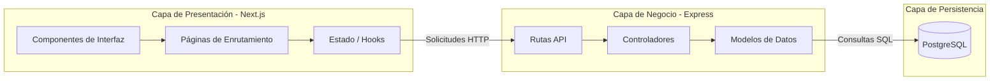

```mermaid
flowchart LR
    subgraph Frontend [Capa de Presentación - Next.js]
        UI[Componentes de Interfaz]
        Pages[Páginas de Enrutamiento]
        State[Estado / Hooks]
    end

    subgraph Backend [Capa de Negocio - Express]
        Router[Rutas API]
        Controller[Controladores]
        Model[Modelos de Datos]
    end

    subgraph Database [Capa de Persistencia]
        DB[(PostgreSQL)]
    end

    UI --> Pages
    Pages --> State
    State -->|Solicitudes HTTP| Router
    Router --> Controller
    Controller --> Model
    Model -->|Consultas SQL| DB
```
