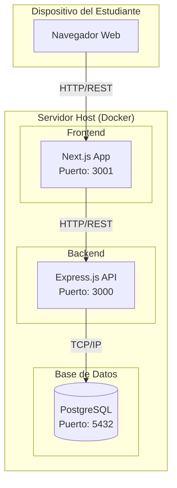

```mermaid
flowchart TD
    subgraph Cliente ["Dispositivo del Estudiante"]
        N[Navegador Web]
    end

    subgraph DockerHost ["Servidor Host (Docker)"]
        subgraph ContenedorFrontend ["Frontend"]
            NextJS[Next.js App\nPuerto: 3001]
        end

        subgraph ContenedorBackend ["Backend"]
            Express[Express.js API\nPuerto: 3000]
        end

        subgraph ContenedorDB ["Base de Datos"]
            Postgres[(PostgreSQL\nPuerto: 5432)]
        end
    end

    N -- HTTP/REST --> NextJS
    NextJS -- HTTP/REST --> Express
    Express -- TCP/IP --> Postgres
```
