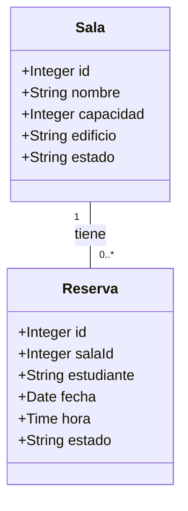

```mermaid
classDiagram
    class Sala {
        +Integer id
        +String nombre
        +Integer capacidad
        +String edificio
        +String estado
    }
    
    class Reserva {
        +Integer id
        +Integer salaId
        +String estudiante
        +Date fecha
        +Time hora
        +String estado
    }
    
    Sala "1" -- "0..*" Reserva : tiene
```
