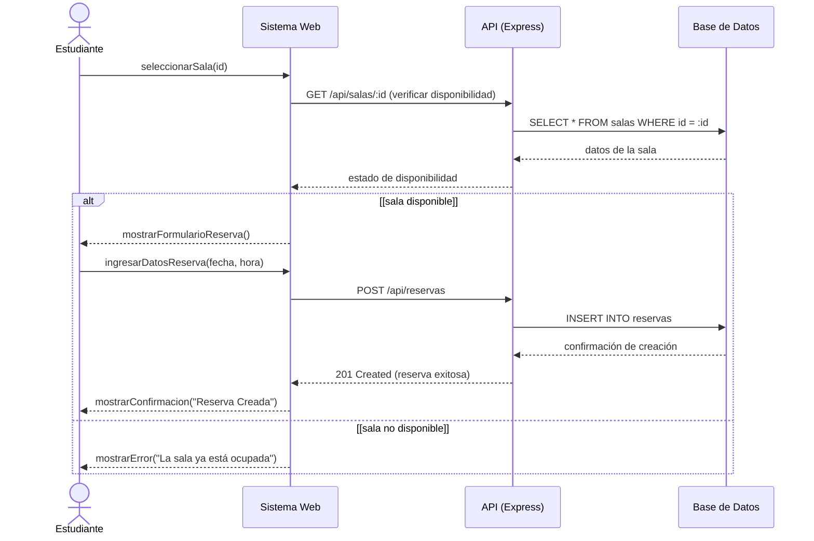

```mermaid
sequenceDiagram
    actor Estudiante
    participant Frontend as Sistema Web
    participant Backend as API (Express)
    participant DB as Base de Datos

    Estudiante->>Frontend: seleccionarSala(id)
    Frontend->>Backend: GET /api/salas/:id (verificar disponibilidad)
    Backend->>DB: SELECT * FROM salas WHERE id = :id
    DB-->>Backend: datos de la sala
    Backend-->>Frontend: estado de disponibilidad

    alt [sala disponible]
        Frontend-->>Estudiante: mostrarFormularioReserva()
        Estudiante->>Frontend: ingresarDatosReserva(fecha, hora)
        Frontend->>Backend: POST /api/reservas
        Backend->>DB: INSERT INTO reservas
        DB-->>Backend: confirmación de creación
        Backend-->>Frontend: 201 Created (reserva exitosa)
        Frontend-->>Estudiante: mostrarConfirmacion("Reserva Creada")
    else [sala no disponible]
        Frontend-->>Estudiante: mostrarError("La sala ya está ocupada")
    end
```
